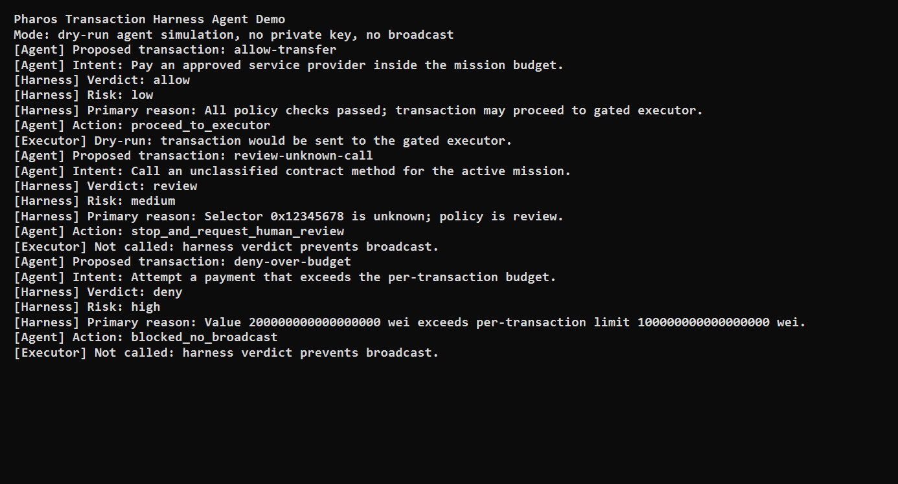

# Pharos Transaction Harness

<p align="center">
  
</p>

A reusable Skill package for reviewing and gating AI agent transaction behavior on Pharos.

The Skill evaluates a proposed transaction before an agent signs or broadcasts it, then returns a policy verdict:

- `allow`
- `deny`
- `review`

It also includes a reference executor demo that only broadcasts a transaction after an `allow` verdict. This proves the harness can sit in the transaction path, while staying honest that true enforcement requires the agent runtime to make the harness the only signer/RPC gateway.

## What It Can Intercept

The harness is designed to catch risky transaction requests before they become signed transactions.

| Behavior | Verdict | How it is detected |
| --- | --- | --- |
| Transaction on an unapproved chain | `deny` | `chainId` is not listed in `allowedChainIds` |
| Transaction to a blocked recipient | `deny` | `to` address appears in `deniedAddresses` |
| Transaction to a recipient outside the allowlist | `review` | `allowedAddresses` is configured and `to` is not included |
| Native transfer when native transfers are disabled | `deny` | `data` is `0x` and `allowNativeTransfers` is `false` |
| Transfer amount above the per-transaction budget | `deny` | `valueWei` exceeds `maxValueWeiPerTx` |
| Transfer amount above the remaining daily budget | `deny` | `valueWei` exceeds `remainingDailyValueWei` |
| Contract call to an explicitly allowed function | `allow` | first 4 bytes of calldata match `allowedSelectors` |
| Contract call to a sensitive function | `review` | selector matches `reviewSelectors`, for example ERC20 `approve` |
| Contract call with unknown calldata | `allow`, `deny`, or `review` | controlled by `unknownCalldata` policy |
| Malformed calldata selector | `review` | calldata is not a native transfer and has no valid 4-byte selector |

The project ships with examples for the three core outcomes:

```bash
npm run evaluate -- examples/allow-transfer.request.json examples/policy.basic.json
npm run evaluate -- examples/review-unknown-call.request.json examples/policy.basic.json
npm run evaluate -- examples/deny-over-budget.request.json examples/policy.basic.json
```

## Example Verdict

A denied over-budget transaction returns a machine-readable result like:

```json
{
  "verdict": "deny",
  "riskLevel": "high",
  "requiredActions": ["Do not sign or broadcast this transaction."]
}
```

The full verdict also includes matched rules, human-readable reasons, and audit metadata.

## Enforcement Model

This package implements two levels:

```text
Level 1: Advisory verdict
Agent -> Harness -> allow / deny / review

Level 2: Reference executor demo
Agent -> Harness -> executor broadcasts only if verdict = allow
```

True hard enforcement requires Level 3 runtime integration:

```text
Agent -> Harness -> Signer/RPC
```

In Level 3, the agent must not have a separate private key, signer handle, wallet session, or unrestricted RPC broadcast path. See `references/enforcement-model.md`.

## Quick Start

```bash
npm install
npm test
npm run demo:agent
npm run evaluate -- examples/allow-transfer.request.json examples/policy.basic.json
```

`demo:agent` is the best command for judge demos because it shows an agent-style flow:

```text
Agent proposes transaction -> Harness returns verdict -> Agent proceeds, requests review, or blocks broadcast
```

## Demo Screenshot



## Demo Executor

The executor is optional and intended for Pharos testnet demos.

```bash
cp .env.example .env
npm run demo:execute -- examples/allow-transfer.request.json examples/policy.basic.json
```

Never put production private keys in this demo.

## Policy Shape

Policies live in JSON so they can be inspected by humans and agents:

```json
{
  "name": "pharos-testnet-basic-agent-policy",
  "allowedChainIds": [688688],
  "allowedAddresses": ["0x1111111111111111111111111111111111111111"],
  "deniedAddresses": ["0x9999999999999999999999999999999999999999"],
  "maxValueWeiPerTx": "100000000000000000",
  "remainingDailyValueWei": "500000000000000000",
  "allowNativeTransfers": true,
  "allowedSelectors": ["0xa9059cbb"],
  "reviewSelectors": ["0x095ea7b3"],
  "unknownCalldata": "review"
}
```

The schema files in `schema/` define the exact request, policy, and verdict contracts.

## Structure

```text
SKILL.md      Agent-facing capability entry
schema/       Input, policy, and verdict schemas
src/          Pure policy evaluator and audit helpers
scripts/      CLI and reference executor
examples/     Request and policy examples
demo/         Agent integration sample
references/   Enforcement model notes
assets/       Small diagrams and static artifacts
tests/        Verification tests
```
